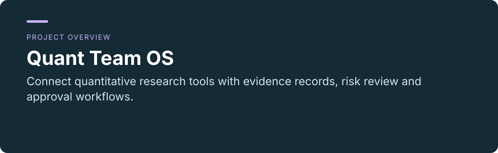
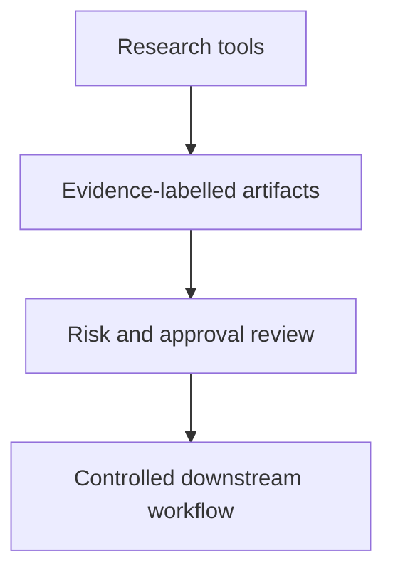

 

# Quant Team OS

**Connect quantitative research tools with evidence records, risk review and approval workflows.**

[Project usage and maintenance](../README.md) · [Report an issue](https://github.com/thejaytang/quant-team-os/issues)

## 1. What you can do

- Label research evidence as verified, sample or unverified.
- Keep orchestration, domain schemas and policy checks around established infrastructure.

## 2. Start here

Read the [core-stack guide](../README.md#core-stack-daily-driver) before running anything. The documented core stack starts 13 services and requires Docker plus project configuration; it is not a lightweight single-command demo.

## 3. Use cases

These are illustrative scenarios. Only explicitly linked execution artifacts represent checks performed for this update.

| Input or request | Expected result |
|---|---|
| A research artifact | Evidence grade and review context |
| A proposed trading workflow | Policy checks and explicit approval state |

## 4. Requirements and current limits

Integration platform under development. External providers and credentials need separate configuration. Live trading remains locked by default. The CI run triggered by this update cannot resolve `pyqlib` under Python 3.13; see the [check results](https://github.com/thejaytang/quant-team-os/actions/runs/35663543220). The preceding commit also had failing CI. This presentation update does not start the stack, verify broker connectivity or establish investment performance. Related repositories have different scopes; their names and dates do not establish a replacement order.

## 5. Documentation and sources

These links identify the implementation, operating instructions or related projects for a closer fit check.

- [Operating guide](../README.md)
- [Architecture iteration](../docs/v0_4_iteration.md)
- [Tool-oriented platform](https://github.com/thejaytang/quant-team-os)
- [Research scaffold](https://github.com/thejaytang/trading-os)
- [Related scaffold](https://github.com/thejaytang/multi-agent-quant-trading-system)
- [Manual decision support](https://github.com/thejaytang/finance-exploration)

## 6. License and maintenance

No repository-wide license is declared at the root. This presentation update does not change the terms of code, data or third-party material; confirm permission for the material you want to reuse.

This is the public introduction. Linked project documents remain authoritative for operation, constraints and maintenance. Presentation updated: 2026-09-22.
