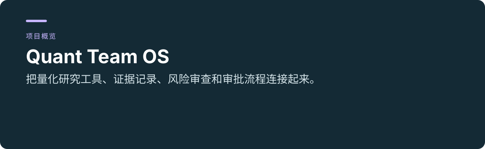
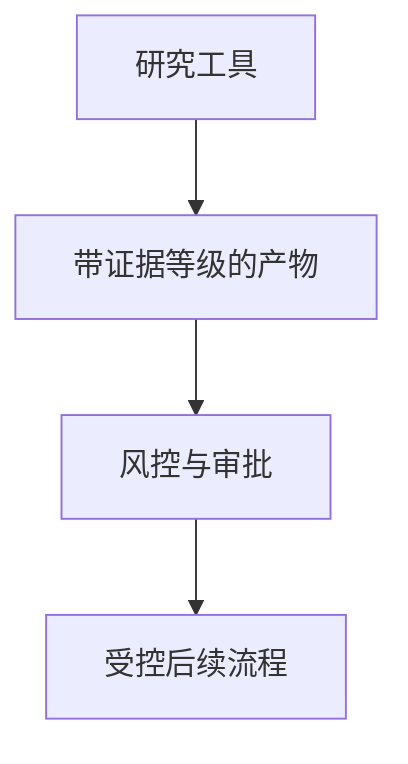

 

# Quant Team OS

**把量化研究工具、证据记录、风险审查和审批流程连接起来。**

[项目使用与维护入口](../README.md) · [报告问题](https://github.com/thejaytang/quant-team-os/issues)

## 1. 能完成什么

- 明确标记研究证据为 verified、sample 或 unverified。
- 围绕已有基础设施维护编排、领域结构与策略检查。

## 2. 从这里开始

运行前先读[核心服务指南](../README.md#core-stack-daily-driver)。所记录的核心栈会启动 13 个服务，需要 Docker 和项目配置，不是轻量单命令演示。

## 3. 使用场景

以下为说明性场景；只有明确链接的运行产物才代表本次检查结果。

| 输入或请求 | 预期结果 |
|---|---|
| 研究产物 | 证据等级与审核上下文 |
| 拟议交易流程 | 策略检查与明确审批状态 |

## 4. 使用条件与当前边界

开发中的集成平台。外部服务和凭据需要单独配置，实盘默认锁定。本次更新触发的自动检查在 Python 3.13 下无法安装 `pyqlib`，详见[检查记录](https://github.com/thejaytang/quant-team-os/actions/runs/35663543220)。前一提交的自动检查也已失败。本次展示更新没有启动全栈、验证券商连接或证明投资表现。相关仓库的范围不同，名称和日期不能证明彼此替代关系。

## 5. 资料与来源

下面链接指向实现、操作说明或相关项目，便于进一步判断适用性。

- [操作指南](../README.md)
- [架构迭代](../docs/v0_4_iteration.md)
- [工具集成平台](https://github.com/thejaytang/quant-team-os)
- [研究脚手架](https://github.com/thejaytang/trading-os)
- [相关研究脚手架](https://github.com/thejaytang/multi-agent-quant-trading-system)
- [人工决策辅助](https://github.com/thejaytang/finance-exploration)

## 6. 许可与维护

仓库尚未在根目录声明统一许可证；本次展示更新没有改变代码、数据或第三方材料的许可。复用前请确认对应材料的授权。

本页为对外介绍。具体操作、约束和维护说明以链接的项目文档为准。展示页更新：2026-09-22。
